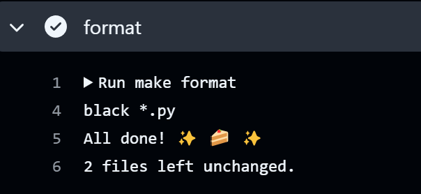
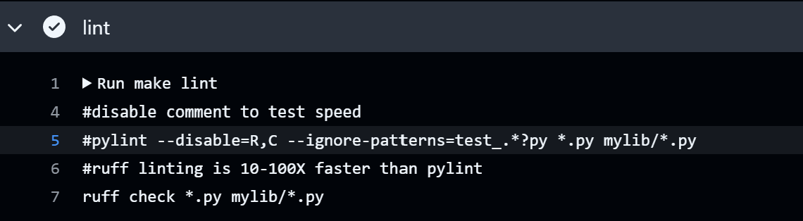
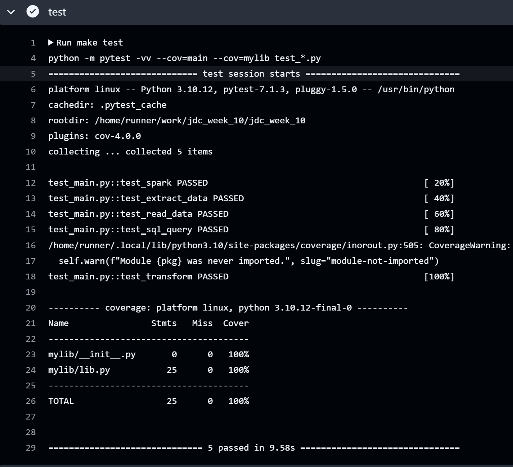

## PySpark Data Processing :computer: 

The purpose of this project is to use PySpark to perform data processing on a large dataset with at least one Spark SQL query and one data transformation. This was all done using Github codespaces as a virtual environment rather than downloading PySpark locally. The  is extracted from a url and loaded as a csv. It contains historical results of the NBA draft projection model, 2001-2015.

## Functionality and commands:
* lib.py - contains functions to initialize a spark session, extract the data and save it into the local directory, read in the data as a spark dataframe, perform a SQL query, and transform the data using pyspark.sql functions. 
* main.py - imports function from lib and runs the operations.
* test_main.py - tests each operation
* CI/CD pipeline   
* requirements.txt
* Makefile
* Dockerfile and devcontainer

## Preparation and usage
1. Open codespaces 
2. Load repo to code spaces
3. Wait for installation of all requirements in requirements.txt
4. Run main.py to load in database and run queries

## Check format and test errors
1. Format code `make format`


2. Lint code `make lint`


3. Test code `make test`


(alternatively, do all with `make all`)

## Query Explanation:
```sql

    WITH avg_superstar AS (
    SELECT AVG(Superstar) AS avg_superstar_score
    FROM nba_data
    )
    SELECT Player, Superstar - avg_superstar_score as Above_Average
    FROM nba_data, avg_superstar
    WHERE Superstar > avg_superstar_score
    ORDER BY Superstar DESC;

```
This query uses a CTE (common table expression) to get the average probability of becoming a superstar player using the 'WITH' clause. I then compare each player's probability of becoming a superstar to the average. I then only display players who have a probability higher than the average of their position. I order the players by their superstar probability in descending order and display how far above the average they are. 

## Transformation Explanation:
I add a column (Projected Starter) to the dataframe that indicates whether a player is projected to be a starter in the NBA based on their Projected SPM. If the Projected SPM is >= 0.5, then they are considered a Projected Starter, or else they are not. 

### Data before transformation:
+--------------------+--------+--------------------+----------+-------------+-----------+-----------+-----------+-----------+
|              Player|Position|                  ID|Draft Year|Projected SPM|  Superstar|    Starter|Role Player|       Bust|
+--------------------+--------+--------------------+----------+-------------+-----------+-----------+-----------+-----------+
|  Karl-Anthony Towns|       C|  karl-anthony-towns|      2015|  1.030605703|0.134766667|0.427183333|0.163083333|0.274966667|
|     Justise Winslow|      SF|     justise-winslow|      2015|  0.875328997|0.083528571|0.510904762|0.176766667|     0.2288|
|     Stanley Johnson|      SF|     stanley-johnson|      2015|  0.679493305|     0.0678|0.423733333|     0.2785|0.229966667|
|       Jahlil Okafor|       C|       jahlil-okafor|      2015|  0.521661276|0.058716667|     0.4099|0.235533333|    0.29585|
|    D`Angelo Russell|      PG|    d-angelo-russell|      2015|  0.511966664|0.152033333|0.342283333|0.096583333|     0.4091|
|      Dakari Johnson|       C|      dakari-johnson|      2015|  0.491787354|0.021340778| 0.36754357|0.417571997|0.193543655|
|        Devin Booker|      SG|      3-devin-booker|      2015|  0.472577305|0.073366667|0.324466667|0.390166667|      0.212|
| Willie Cauley-Stein|       C| willie-cauley-stein|      2015|  0.351171383|0.047114455|0.405989863|0.243185719|0.303709963|
|Rondae Hollis-Jef...|      SF|rondae-hollis-jef...|      2015|  0.311909198|0.014589784|0.368533143|0.392480667|0.224396406|
|          Trey Lyles|      PF|          trey-lyles|      2015|  0.267509411|0.022385714|0.351328571|0.403052381|0.223233333|
|          Sam Dekker|      SF|          sam-dekker|      2015|  0.254164944|0.008691989|0.385003946|0.329053601|0.277250464|
|     Kelly Oubre Jr.|      SF|      kelly-oubre-jr|      2015|  0.247310247|0.019833333|0.378983333|0.337966667|0.263216667|
|          Tyus Jones|      PG|          tyus-jones|      2015|  0.243548797|     0.0272|0.414561905|0.284404762|0.273833333|
|        Kevon Looney|      PF|        kevon-looney|      2015|  0.204173217|     0.0083|0.355566667|0.374916667|0.261216667|
|        Myles Turner|      PF|      2-myles-turner|      2015|  0.076381303|0.029416667|0.335797619|0.318516667|0.316269048|
|     Cliff Alexander|      PF|     cliff-alexander|      2015|  0.026133537|0.007633333|0.294783333|0.406616667|0.290966667|
|      Christian Wood|      PF|      christian-wood|      2015| -0.019560841|0.008396848| 0.31111083|0.393687898|0.286804424|
|      Frank Kaminsky|       C|      frank-kaminsky|      2015| -0.072352472|0.006718361|0.352834529|0.327164489|0.313282621|
|  Michael Frazier II|      SG|  michael-frazier-ii|      2015|  -0.16705094|0.010083843|0.254306634|0.381989035|0.353620488|
|      Brandon Ashley|      PF|      brandon-ashley|      2015| -0.170210127|0.011186812|0.253264673|0.356138802|0.379409713|
+--------------------+--------+--------------------+----------+-------------+-----------+-----------+-----------+-----------+
only showing top 20 rows

### Data after tranformation:
+--------------------+--------+--------------------+----------+-------------+-----------+-----------+-----------+-----------+-----------------+
|              Player|Position|                  ID|Draft Year|Projected SPM|  Superstar|    Starter|Role Player|       Bust|Projected Starter|
+--------------------+--------+--------------------+----------+-------------+-----------+-----------+-----------+-----------+-----------------+
|  Karl-Anthony Towns|       C|  karl-anthony-towns|      2015|  1.030605703|0.134766667|0.427183333|0.163083333|0.274966667|              Yes|
|     Justise Winslow|      SF|     justise-winslow|      2015|  0.875328997|0.083528571|0.510904762|0.176766667|     0.2288|              Yes|
|     Stanley Johnson|      SF|     stanley-johnson|      2015|  0.679493305|     0.0678|0.423733333|     0.2785|0.229966667|              Yes|
|       Jahlil Okafor|       C|       jahlil-okafor|      2015|  0.521661276|0.058716667|     0.4099|0.235533333|    0.29585|              Yes|
|    D`Angelo Russell|      PG|    d-angelo-russell|      2015|  0.511966664|0.152033333|0.342283333|0.096583333|     0.4091|              Yes|
|      Dakari Johnson|       C|      dakari-johnson|      2015|  0.491787354|0.021340778| 0.36754357|0.417571997|0.193543655|               No|
|        Devin Booker|      SG|      3-devin-booker|      2015|  0.472577305|0.073366667|0.324466667|0.390166667|      0.212|               No|
| Willie Cauley-Stein|       C| willie-cauley-stein|      2015|  0.351171383|0.047114455|0.405989863|0.243185719|0.303709963|               No|
|Rondae Hollis-Jef...|      SF|rondae-hollis-jef...|      2015|  0.311909198|0.014589784|0.368533143|0.392480667|0.224396406|               No|
|          Trey Lyles|      PF|          trey-lyles|      2015|  0.267509411|0.022385714|0.351328571|0.403052381|0.223233333|               No|
|          Sam Dekker|      SF|          sam-dekker|      2015|  0.254164944|0.008691989|0.385003946|0.329053601|0.277250464|               No|
|     Kelly Oubre Jr.|      SF|      kelly-oubre-jr|      2015|  0.247310247|0.019833333|0.378983333|0.337966667|0.263216667|               No|
|          Tyus Jones|      PG|          tyus-jones|      2015|  0.243548797|     0.0272|0.414561905|0.284404762|0.273833333|               No|
|        Kevon Looney|      PF|        kevon-looney|      2015|  0.204173217|     0.0083|0.355566667|0.374916667|0.261216667|               No|
|        Myles Turner|      PF|      2-myles-turner|      2015|  0.076381303|0.029416667|0.335797619|0.318516667|0.316269048|               No|
|     Cliff Alexander|      PF|     cliff-alexander|      2015|  0.026133537|0.007633333|0.294783333|0.406616667|0.290966667|               No|
|      Christian Wood|      PF|      christian-wood|      2015| -0.019560841|0.008396848| 0.31111083|0.393687898|0.286804424|               No|
|      Frank Kaminsky|       C|      frank-kaminsky|      2015| -0.072352472|0.006718361|0.352834529|0.327164489|0.313282621|               No|
|  Michael Frazier II|      SG|  michael-frazier-ii|      2015|  -0.16705094|0.010083843|0.254306634|0.381989035|0.353620488|               No|
|      Brandon Ashley|      PF|      brandon-ashley|      2015| -0.170210127|0.011186812|0.253264673|0.356138802|0.379409713|               No|
+--------------------+--------+--------------------+----------+-------------+-----------+-----------+-----------+-----------+-----------------+
only showing top 20 rows
